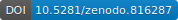
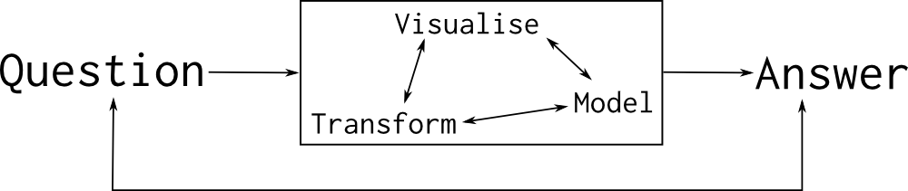
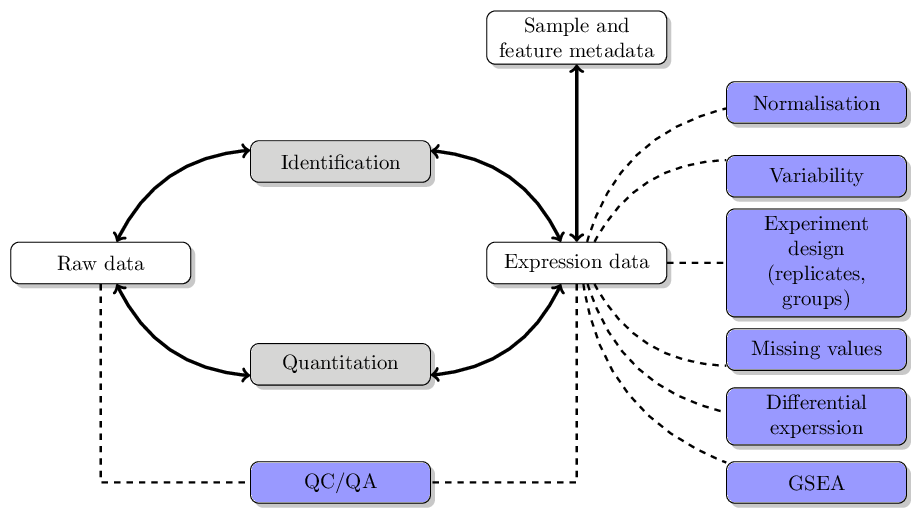
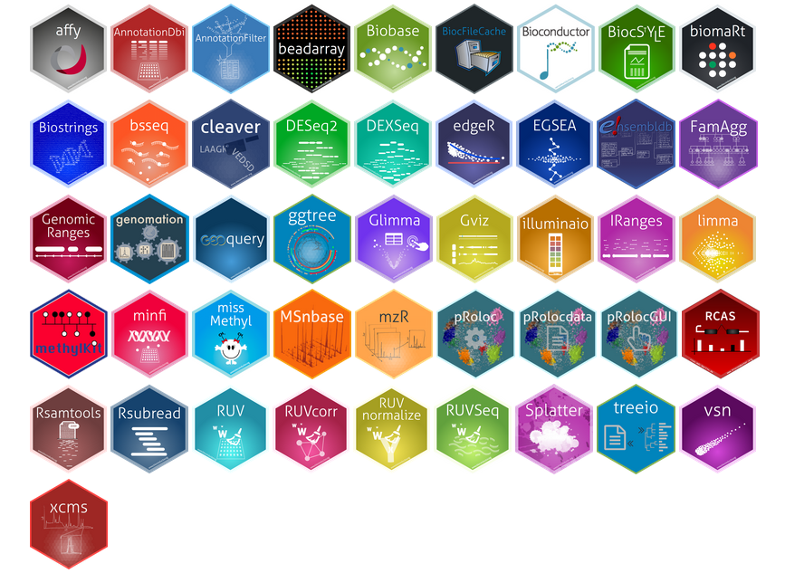
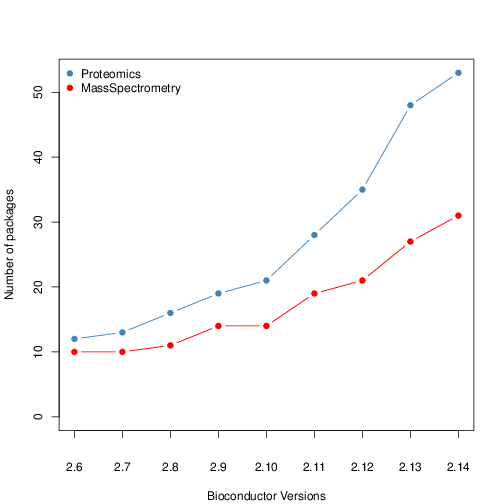
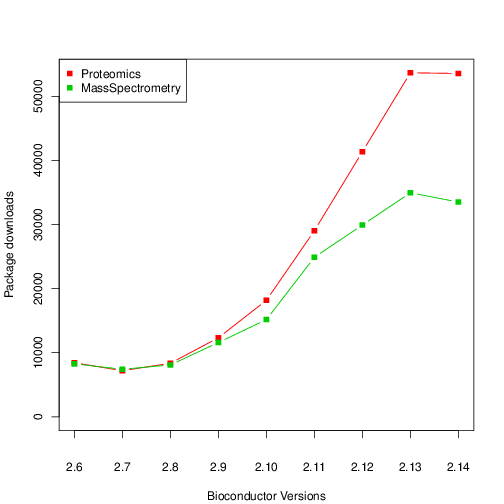
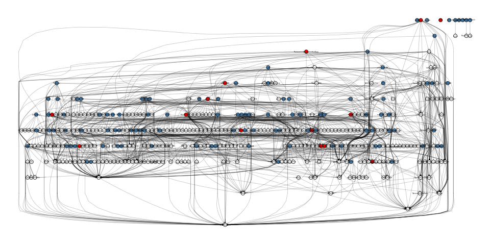
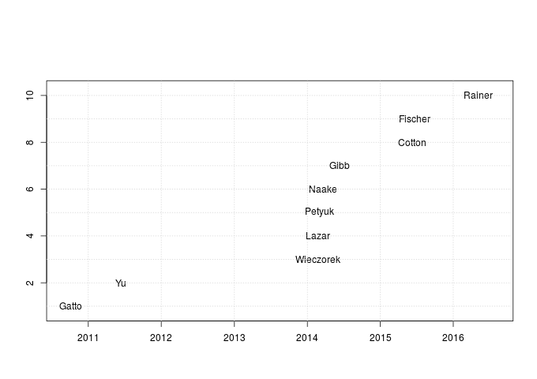
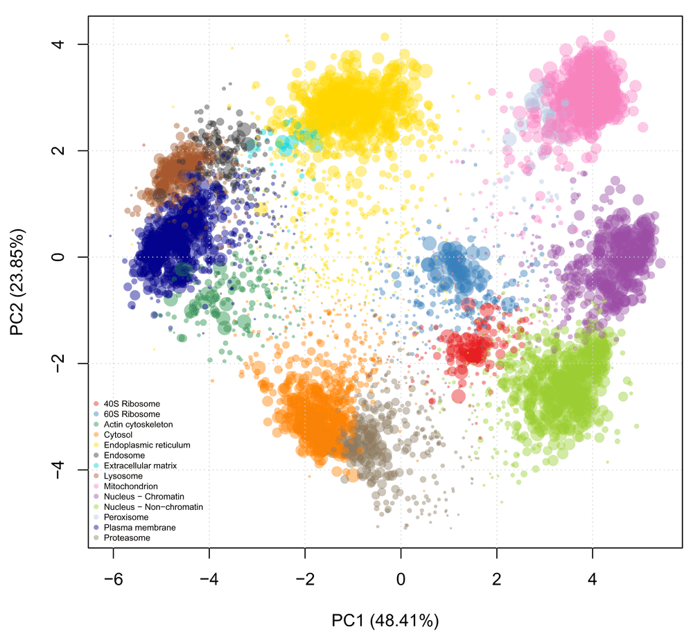

```{r env, echo=FALSE}
library("BiocStyle")
```

## The Bioconductor project - analysis and comprehension of high-throughput proteomics data

```
Laurent Gatto                      Computational Proteomics Unit
https://lgatto.github.io           University of Cambridge
lg390@cam.ac.uk                    @lgatt0
```

Link to slides: [http://bit.ly/20170623pmf](http://bit.ly/20170623pmf) -- [](https://doi.org/10.5281/zenodo.816287)

## Licence

These slides are available under a creative common
[CC-BY license](http://creativecommons.org/licenses/by/4.0/). You are
free to share (copy and redistribute the material in any medium or
format) and adapt (remix, transform, and build upon the material) for
any purpose, even commercially.


## Table of content {.fullpage}

**Data analysis**  &#9679; **Proteomics**  &#9679; **R/Bioconductor**  &#9679; **Conclusions**


(Bioconductor [CSAMA 2017 workshop](http://www.huber.embl.de/csama2017/), Mount Plose)


# Data analysis

## What is data analysis

> Data analysis is the process by which data becomes understanding,
> knowledge and insight. Hadley Wickham

The ability to prepare and **explore** data, identify **patterns**
(good and pathological ones) and convincingly demonstrate that the
patterns are **genuine** (rather than random).

It's not analysing data, it's *investigating* data - requires **flexibility**.

##

  


## And also

* Reproducibility/replicability
* Automation
* Tracking, re-use, share, communicate


`Data programming`,  but:

* Learning curve (although, I would argue that the
  reflecting/investigating/analysing the data is the real challenge)


## To analyse data, you need

* ~~Be a programmer~~
* ~~Be a statistician/machine learner~~

## To analyse data, you need

* ~~Be a programmer~~
* ~~Be a statistician/machine learner~~
* Knowledge about the domain
* Know about your data
* Be able to manipulate/visualise it
* How good do we need to be?

## To analyse data, you need

* ~~Be a programmer~~
* ~~Be a statistician/machine learner~~
* Knowledge about the domain
* Know about your data
* Be able to manipulate/visualise it
* How good do we need to
  be?
  [**Good enough**](http://journals.plos.org/ploscompbiol/article?id=10.1371/journal.pcbi.1005510) (Wilson
  *et al.*, 2017)

## Visualisation

To understand and communication data:

> Graphics reveal data.

  
> Visualization can surprise you, but it doesn’t scale well. Modeling
> scales well, but it can’t surprise you. Hadley Wickham

# Proteomics

## Quantitative proteomics data analysis

* What data do we have? 
* What analyses can we apply?
* Track/check the data throughout the analysis.

## Example ... { .fullpage }



## Example ... { .fullpage }


##

It is not for the tool/software to tell me what plotting/analysis to
perform; it is **for me** to apply the most appropriate analysis or
visualisation.
  
  
It is not for the tool/software to tell me what plotting/analysis to
perform; it is **for me** to ask the most **appropriate question**.
  
  
# Software: R/Bioconductor

## 

Data analysis tools should enables you to **manipulate** your data,
give some guarantees about the **integrity** of the data, support
effective **extract/subset** components of the data, **visualise**
them, enable **transformation** of the data, give access to
infrastucture for **statistical analysis**, and enable **annotation**
of the data.


## 

[Bioconductor](https://bioconductor.org/) provides tools for the
analysis and comprehension of high-throughput biology data. Uses the [R
statistical programming language](https://www.r-project.org/).

**Collaborative project**: open source and open development, involving
biologists, statisticians, programmers, ...

<font size="4"> Huber W *et
al.*
[Orchestrating high-throughput genomic analysis with Bioconductor](https://www.ncbi.nlm.nih.gov/pubmed/25633503). Nat
Methods. 2015 Jan 29;12(2):115-21.</font>

## {.fullpage}



## 

~ [1400 packages](https://bioconductor.org/packages/release/BiocViews.html#___Software) &#9679; 62 for [mass spectrometry](https://bioconductor.org/packages/release/BiocViews.html#___MassSpectrometry) &#9679; 92 for [proteomics](https://bioconductor.org/packages/release/BiocViews.html#___Proteomics)

<div class="double">
<p class="double-flow"></p>

</div>

##  {.fullpage}




## *MSnbase* [collaborative development](https://lgatto.github.io/msnbase-contribs/) {.fullpage}




## 

<div class="double">
<p class="double-flow">
- The `r Biocpkg("mzR")` package: raw and identification data.
- The `r Biocpkg("MSnbase")` package: MS and proteomics infrastructure
- The `r Biocpkg("xcms")` package: metabolomics.
- The `r Biocpkg("pRoloc")` package: innovative ML and spatial proteomics.
</p>
<p class="double-flow">  </p> </div>


## The `mzR` package

`r Biocpkg("mzR")`: Efficient access to raw and (`netCDF`, `mzData`,
`mzXML`, `mzML`) identification (`mzIdentML`).

<font size="4">Chambers *et
al.*. [A cross-platform toolkit for mass spectrometry and proteomics](https://www.ncbi.nlm.nih.gov/pubmed/23051804). Nature
Biotechnology (2012). </font>

## The `MSnbase` package

`r Biocpkg("MSnbase")`: Convenient infrastucture for mass spectrometry
and proteomics data analyis.

<font size="4">Laurent Gatto and Kathryn
S. Lilley. [`MSnbase` - an R/Bioconductor package for isobaric tagged mass spectrometry data visualization, processing and quantitation](https://www.ncbi.nlm.nih.gov/pubmed/22113085). Bioinformatics
28, 288-289 (2012).</font>


## The `MSnSet` class for quantitative data

<div class="double">
<p class="double-flow">
* Expression/quantitative data
* Feature meta-data
* Sample meta-data
* Dimension constrains

</p><p class="double-flow">

</p>
</div>
Can be subsetted, transformed, visualised, annotated, statistics, ...

## The `pRoloc` package

`r Biocpkg("pRoloc")`: A unifying analysis framework for spatial
proteomics: visualisation,
classification,
[novelty detection](https://www.ncbi.nlm.nih.gov/pubmed/23523639),
[transfer learning](http://journals.plos.org/ploscompbiol/article?id=10.1371/journal.pcbi.1004920),
Bayesian learning (coming soon).

<font size="4">Gatto L, Breckels LM, Wieczorek S, Burger T, Lilley
KS. [Mass-spectrometry-based spatial proteomics data analysis using `pRoloc` and `pRolocdata`](https://www.ncbi.nlm.nih.gov/pubmed/24413670). Bioinformatics. 2014
May 1;30(9):1322-4.  
Breckels LM, Mulvey CM, Lilley KS and Gatto
L. [A Bioconductor workflow for processing and analysing spatial proteomics data](https://f1000research.com/articles/5-2926/). F1000Research
2016, 5:2926 (doi: 10.12688/f1000research.10411.1).</font>

## Transform, annotate, visualise

<div class="double">
<p class="double-flow">
```r
plot2D(msnset, fcol = "loc",
       method = "PCA",
       cex = "svm.score")
```

</p>
<p class="double-flow"></p>
</div>


## References, resources

* Gatto *et al.* (2015) [Visualisation of proteomics data using R and Bioconductor](http://www.ncbi.nlm.nih.gov/pmc/articles/PMC4510819/)
* Gatto and Christoforou (2014), [Using R and Bioconductor for proteomics data analysis](http://arxiv.org/pdf/1305.6559v1.pdf)
* The `r Biocexptpkg("RforProteomics")` package
  and
  [R/Bioconductor workflow](https://rawgit.com/lgatto/bioc-ms-prot/master/lab.html)
* General
  [teaching material](http://lgatto.github.io/TeachingMaterial/) for R
  and more
* [Bioconductor support forum](https://support.bioconductor.org/)


## 

- **Development**:
  [Sebastian Gibb](http://sebastiangibb.de/),
  [Johannes Rainer](https://github.com/jotsetung),
  [Lisa Breckels](https://github.com/lmsimp/)
- **Funding**: BBSRC, Wellcome Trust, FP7

Thank you for your attention

