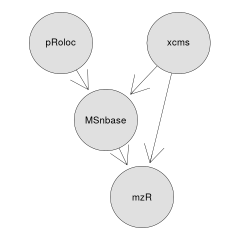

```{r env, echo=FALSE}
library("BiocStyle")
```

## The Bioconductor project - analysis and comprehension of high-throughput proteomics data

```
Laurent Gatto                      Computational Proteomics Unit
https://lgatto.github.io           University of Cambridge
lg390@cam.ac.uk                    @lgatt0
```

Link to slides: [http://bit.ly/20170623pmf](http://bit.ly/20170623pmf)

## Licence

These slides are available under a creative common
[CC-BY license](http://creativecommons.org/licenses/by/4.0/). You are
free to share (copy and redistribute the material in any medium or
format) and adapt (remix, transform, and build upon the material) for
any purpose, even commercially.


## Table of content

# Data analysis

## What is data analysis

> Data analysis is the process by which data becomes understanding,
> knowledge and insight. Hadley Wickham

The ability to prepare and **explore** data, identify **patterns**
(good and pathological ones) and convincingly demonstrate that the
patterns are **genuine** (rather than random).

It's not analysing data, it's *investigating* data - requires flexibility.

##

  


## And also

* Reproducibility/replicability
* Automation
* Tracking, re-use, share, communicable


`Programming`,  but:

* Learning curve (although, I would argue that the
  reflecting/investigating/analysing the data is the real challenge)


## To analyse data, you need

* ~~Be a programmer~~
* ~~Be a statistician/machine learner~~

## To analyse data, you need

* ~~Be a programmer~~
* ~~Be a statistician/machine learner~~
* Knowledge about the domain
* Know about your data
* Be able to manipulate/visualise it
* How good do we need to be?

## To analyse data, you need

* ~~Programming skills~~
* ~~Be a statistician/machine learner~~
* Knowledge about the domain
* Know about your data
* Be able to manipulate/visualise it
* How good do we need to be? **Good enough**

## Visualisation

To understand and communication data:

> Graphics reveal data.

  
> Visualization can surprise you, but it doesn’t scale well. Modeling
> scales well, but it can’t surprise you. Hadley Wickham

# Proteomics

## Quantitative proteomics data analysis

* What data do we have? 
* What analyses can we apply?
* Track/check the data throughout the analysis.

## Example ... { .fullpage }


## Example ... { .fullpage }


##

It is not for the tool/software to tell me what plotting/analysis to
perform, it is **for me**, to apply the most appropriate analysis or
visualisation.
  
  
It is not for the tool/software to tell me what plotting/analysis to
perform, it is **for me**, to ask the most **appropriate question**.
  
  
# Software: R/Bioconductor

## 

Data analysis tools should enables you to **manipulate** your data,
give some guarantees about the **integrity** of the data, support
effective **extract/subset** components of the data, **visualise**
them, enable **transformation** of the data, give access to
infrastucture for **statistical analysis**, and enable **annotation**
of the data.


## Bioconductor

[Bioconductor](https://bioconductor.org/) provides tools for the
analysis and comprehension of high-throughput biology data.

- ~ [1400 packages](https://bioconductor.org/packages/release/BiocViews.html#___Software)
- 62 for [mass spectrometry](https://bioconductor.org/packages/release/BiocViews.html#___MassSpectrometry)
- 92 for [proteomics](https://bioconductor.org/packages/release/BiocViews.html#___Proteomics)

**Collaborative project**: open source and open development.

##  {.fullpage}


## *MSnbase* [collaborative development](https://lgatto.github.io/msnbase-contribs/) {.fullpage}


## R/Bioconductor 

A small glimps into the Bioconductor infrastructure available for mass
spectrometry and proteomics

<div class="double">
<p class="double-flow">
- The `r Biocpkg("mzR")` package: efficient parsing of raw and
  identification data.
- The `r Biocpkg("MSnbase")` package: MS and proteomics infrastructure
  for robust analysis.
- The `r Biocpkg("xcms")` package: metabolomics.
- The `r Biocpkg("pRoloc")` package: inovative machine learning and
  spatial proteomics.
</p><p class="double-flow">

</p>
</div>


## `mzR`

Efficient access to raw and (`netCDF`, `mzData`, `mzXML`, `mzML`)
identification (`mzIdentML`).

> Chambers *et al.*. A cross-platform toolkit for mass spectrometry
> and proteomics. Nature Biotechnology (2012).

## `MSnbase`

Convenient infrastucture for mass spectrometry and proteomics data
analyis.

> Laurent Gatto and Kathryn S. Lilley. `MSnbase` - an R/Bioconductor
> package for isobaric tagged mass spectrometry data visualization,
> processing and quantitation. Bioinformatics 28, 288-289 (2012).


## The `MSnSet` class for quantitative data

<div class="double">
<p class="double-flow">
* Expression/quantitative data
* Feature meta-data
* Sample meta-data
* Dimension constrains

</p><p class="double-flow">

</p>
</div>

Can be subsetted, transformed, visualised, annotated, statistics, ...

# Conclusions

## [Some brief advice on data analysis](https://lgatto.github.io/brief-data-analysis-advice/)

- Plan ahead
- Factor in analysis time
- Analyse early, analyse often
- Divide and conquer
- Ask for help
- Be pragmatic

## References, resources

* Gatto *et al.* (2015) [Visualisation of proteomics data using R and Bioconductor](http://www.ncbi.nlm.nih.gov/pmc/articles/PMC4510819/)
* Gatto and Christoforou (2014), [Using R and Bioconductor for proteomics data analysis](http://arxiv.org/pdf/1305.6559v1.pdf)
* The `r Biocexptpkg("RforProteomics")` package
  and
  [R/Bioconductor workflow](https://rawgit.com/lgatto/bioc-ms-prot/master/lab.html)
* General
  [teaching material](http://lgatto.github.io/TeachingMaterial/) for R
  and more
* [Bioconductor support forum](https://support.bioconductor.org/)


## Acknowledgements

### Development

- Sebastian Gibb, Johannes Rainer

### Funding: 
- BBSRC

**Thank you for your attention**

